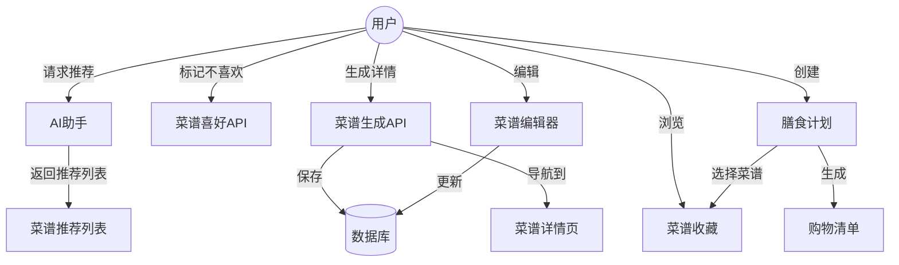

# 菜谱功能架构设计

## 总体架构

## 数据流

### 菜谱推荐流程

1. 用户在聊天界面请求菜谱推荐
2. AI返回基础菜谱信息列表
3. 前端展示菜谱推荐组件
4. 用户可以标记不喜欢或生成详情

### 菜谱生成流程

1. 用户点击"生成菜谱"按钮
2. 前端调用生成API，传递基础信息
3. 后端处理请求，调用AI生成详细内容
4. 保存菜谱到数据库，同时标记为喜欢
5. 返回菜谱ID
6. 前端导航至菜谱详情页

### 菜谱喜好流程

1. 用户点击"不喜欢"按钮
2. 前端调用喜好API，传递菜谱信息
3. 后端保存用户喜好记录
4. 前端更新UI状态

## 组件架构

### 前端组件

1. **RecipeMessageBubble**: 聊天界面中显示菜谱推荐的气泡组件
2. **RecipeRecommendationsEntry**: 菜谱推荐入口组件，根据设备选择对话框或弹出框
3. **RecipeRecommendationItem**: 单个菜谱推荐项组件，包含操作按钮
4. **RecipePage**: 菜谱详情页面，展示完整菜谱信息

### 前端hooks

1. **useRecipePreferences**: 获取用户菜谱喜好
2. **useSetRecipePreference**: 设置菜谱喜好状态
3. **useGenerateRecipe**: 生成菜谱详情
4. **useRecipeDetail**: 获取菜谱详细信息

### 后端服务

1. **RecipeService**: 处理菜谱相关业务逻辑
   - 获取/创建/更新/删除菜谱
   - 获取/设置菜谱喜好
   - 生成菜谱详情

### 数据模型

1. **Recipe**: 菜谱基本模型
2. **RecipePreference**: 菜谱喜好记录模型

## 设计原则

### 1. 渐进式交互

- 先展示基础信息以快速响应
- 用户主动选择需要生成详情的菜谱
- 减少用户等待时间，提升体验

### 2. 响应式设计

- 移动端使用全屏对话框
- 桌面端使用弹出框
- 确保所有操作在各种设备上都可用

### 3. 状态即时反馈

- 喜好状态实时更新
- 操作过程中显示加载状态
- 成功/失败状态清晰展示

### 4. 数据缓存策略

- 菜谱喜好数据缓存到本地
- 详细菜谱信息在生成后缓存
- 优先展示缓存数据，减少加载时间

### 5. AI生成策略

- 基于用户历史喜好进行推荐
- 考虑季节性和流行趋势
- 结合用户饮食限制和偏好

## 扩展计划

### 近期扩展

- 菜谱编辑功能
- 菜谱收藏管理
- 标签系统

### 中期扩展

- 膳食计划功能
- 购物清单生成
- AI辅助编辑

### 长期规划

- 社区分享功能
- 季节性推荐
- 健康饮食分析
